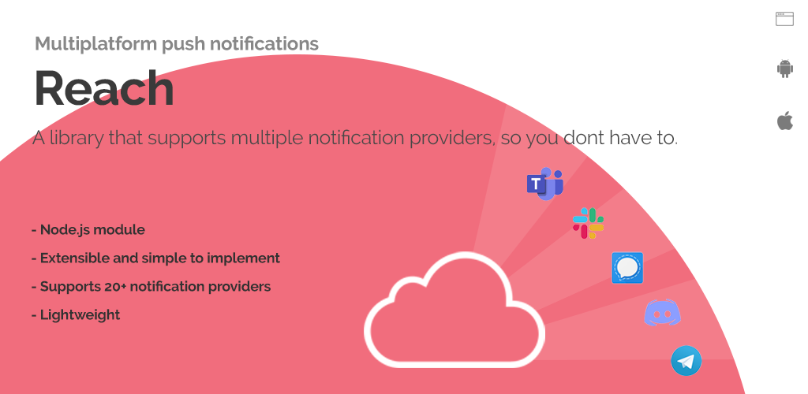

Reach is a node.js module for sending notifications focused on simplicity and extensibility. What's unique about this project? In most cases apps traditionally support a limited set of notification methods, such as email, push notifications or sms, but in some cases, users would prefer being notified in some other way, such as Slack, Whatsapp, Telegram or Discord, or even all of them. The Reach SDK lets you or your app users select and configure their own notification methods, without needing to develop or implement each service.

The project was developed to support my various node.js projects, and avoid redeveloping the same functionality in each of them. I built the module to support <a href="https://www.github.com/paschmann/changd" target="_blank">Changd</a>, which is a website monitoring tool. Using the Reach SDK allows users to select a myriad of notification methods, without the the underlying project having to implement, manage or maintain these options. I was inspired by Apprise (which is written in python) and used Uptime Kuma as a starting point.

If you would like to test out the concept, check out the <A href='https://www.github.com/paschmann/reach-ui' target='_blank'>Reach UI</a>. It is a basic web app that lets you configure and send test notifications for each provider using your own parameters.


## Providers

Notification providers are services which the Reach SDK can send messages to. The Reach SDK has been designed to allow developers and contributors to create or add their own custom providers. If you would like to improve, or create a provider for a service not currently offered, check out the <a href="resources/_template.js" target="_blank">_template</a> in the resources folder, and please submit a pull request.

Below is a list of notification providers the Reach SDK currently supports.

<ul>
<li>Alerta</li>
<li>Amazon SES</li>
<li>Bark</li>
<li>Click Send SMS</li>
<li>Discord</li>
<li>Gitter</li>
<li>Google Chat</li>
<li>IFFFF</li>
<li>Line</li>
<li>Mailgun</li>
<li>Matrix</li>
<li>Mattermost</li>
<li>Microsoft Teams</li>
<li>OneSignal</li>
<li>PagerDuty</li>
<li>SendGrid</li>
<li>Signal</li>
<li>Slack</li>
<li>SMTP</li>
<li>Telegram</li>
<li>Webhook</li>
</ul>
<hr>


## Installing

```
npm install --save reach-sdk
```

## Usage

All notification providers have one common required parameter, named text. This property is the same across all provider types to ensure that the recipient recieves the same notification on any of their selected platforms.

1. Import, create, and instantiate an instance of Reach.

```
const { Reach } = require('reach-sdk');
Reach.init();
```
2. Send a notification (E.g. Slack)

```
const text = "Your order has been received!";

const slack_notification = {
    name: "slack",
    required: {
        slackwebhookURL: "The users webhook URL",
        text: text
    }
}

const discord_notification = {
    name: "discord",
    required: {
		discordWebhookUrl: "The users discord webhook URL",
		text: text
	},
}

console.log(Reach.send(slack_notification));
```


# Supported Notification Services/Providers
## Alerta
#### Parameters
```

        required: {
			alertaApiKey: "",
			alertaApiEndpoint: "",
			alertaEnvironment: "",
			group: "",
			event: "",
			resource: "",
			text: ""
		},
		optional: {
			value: "",
			tags: [""],
			origin: "",
			type: "",
			service: [""],
			correlate: [""],
			severity: ""
		}
```

#### Setup
In Alerta open the menu on the left, select API Keys and create a new API key. The key will need the write:alerts scope. The API Endpoint can be found in the About menu screen.

<hr>

## Amazon SES
#### Parameters
```
        required: {
            accessKeyId: "accessKeyId",
            secretAccessKey: "secretAccessKey",
            from: "",
            to: "",
            subject : "",
            text: ""
        },
        optional: {
            cc: "",
            bcc: "",
            html: "",
            attachments: ""
        }
```

#### Setup
Please follow this document to setup SES: <a href='https://docs.aws.amazon.com/ses/latest/dg/setting-up.html' target='_blank'>Guide</a>

<hr>

## Bark
#### Parameters
```

        required: {
			barkApiUrl: "",
			deviceKey: "",
			title: "",
			text: ""
		},
		optional: {}
```

#### Setup
In order to use Bark push notifications with their iOS app, you need a Bark server. You can set one up using their <a href='https://github.com/Finb/bark-server#for-docker-user' target='_blank'>guide</a> and Docker is a quick and easy option. Once you have the server running, you will need the Server URL and the Device Key parameters, you can find the Device Key in the mobile app in the "Server List" screen (Alphpa numeric code) below the server address.


<hr>

## Click Send SMS
#### Parameters
```

        required: {
			clicksendsmsLogin: "",
			clicksendsmsApiKey: "",
			clicksendsmsToNumber: "",
			clicksendsmsSenderName: "",
			text: ""
		},
		optional: {
            source: ""
        }
```

#### Setup
In the Click Send admin panel, you can get your SMS login and API Key from the Developers, API Credentials screen.

<hr>

## Discord

#### Parameters
```
        required: {
            discordWebhookUrl: "",
            text: ""
        },
        optional: {
            discordUsername: ""
        }
```
#### Setup
In Discord, open the channel settings and select Integrations. Create a new webhook and Copy the Webhook URL into the discordWebhookUrl parameter. The discordUsername can be any string, if empty, it will be the bots name that was provided when creating the webhook.

<hr>

## Gitter

#### Parameters
```
        required: {
            accessToken: "",
            roomId: "",
            text: ""
        },
        optional: {}
```
#### Setup
Gitter notifications require a Personal Access Token, this can be created from their <a href='https://developer.gitter.im/apps' target='_blank'>developer site</a>. Messages can be sent to rooms you are already a member of. In order to get the room ID, you will need to use something like Chrome Developer Tools to view network requests. Open Chrome dev tools and select the Network requests tab, clear the history (if needed) and open the room, this should show the API call to the chatMessages endpoint which will include the room ID. E.g.  https://gitter.im/api/v1/rooms/<b>62d804996da03739849a4d67</b>/chatMessages

<hr>

## Google Chat

#### Parameters
```
        required: {
            googleChatWebhookUrl: "",
            text: ""
        },
        optional: {}
```
#### Setup
Important: webhooks are only enabled for Google Workspace accounts, not personal Gmail accounts.
Please follow this document to setup a incoming webhook and get the URL: <a href='https://developers.google.com/chat/how-tos/webhooks#node.js' target='_blank'>Guide</a>

<hr>

## IFTTT

#### Parameters
```
        required: {
            iftttServiceKey: "",
			eventName: "",
			text: ""
        },
        optional: {}
```
#### Setup
Setup a webhook in IFTTT using this <a href='https://ifttt.com/maker_webhooks/settings' target='_blank'>URL</a>. Next create a new applet and note its name as this needs to be specified in the eventName parameter, use a "Webhook" as the "If" trigger. You can find the iftttServiceKey in Documentation from the <a href='https://ifttt.com/maker_webhooks' target='_blank'>webhooks page</a>.

<hr>

## Line

#### Parameters
```
        required: {
            lineChannelAccessToken: "",
			lineUserID: "",
			text: ""
        },
        optional: {}
```
#### Setup
Open <a href='https://developers.line.biz/console' target='_blank'>Developer Console</a>, create a provider. Open the new provider and create a new Messaging API channel. Complete the required fields and navigate to the new channel. On the Basic Settings screen, scroll to the bottom and note your Line User ID, use this in the required parameter field and where you will recieve your messages. To get a access token, select the "Message API" tab, and create a channel access token at the bottom of the screen.


<hr>

## Mailgun
```
        required: {
            smtpUsername: "",
            smtpPassword: "",
            smtpFrom: "",
            smtpTo: "",
            subject : "",
            text: ""
        },
        optional: {
            smtpCC: "",
            smtpBCC: "",
            html: "",
            attachments: ""
        }
```

#### Setup
Once you have your mailgun account setup, you can get your username and password from the SMTP page on your <a href='https://app.mailgun.com/app/sending/domains' target='_blank'>domain</a>.

<hr>

## SMTP
```
        required: {
            smtpHost: "Server Host",
            smtpPort: "Server Port",
            smtpFrom: "",
            smtpTo: "",
            subject : "",
            text: ""
        },
        optional: {
            smtpIgnoreTLSError: "True/False - Boolean",
            smtpDkimDomain: "",
            smtpDkimKeySelector: "",
            smtpDkimPrivateKey: "",
            smtpDkimHashAlgo: "",
            smtpDkimheaderFieldNames: "",
            smtpDkimskipFields: "",
            smtpUsername: "",
            smtpPassword: "",
            smtpSecure: "TLS?",
            smtpCC: "",
            smtpBCC: "",
            html: "",
            attachments: ""
        }
```

#### Setup
Please follow your hosting providers' instructions for setting up and getting the above parameters.


<hr>

## Signal
```
        required: {
            signalUrl: "",
			signalNumber: "",
			signalRecipients: "",
			text: ""
		},
		optional: {}
```
#### Setup
Signal requires that a middleware Rest API is in place before it can be used with the reach API. Please see this <a href='https://github.com/bbernhard/signal-cli-rest-api' target='_blank'>guide</a> for setting up a middleware layer using docker, you can then use this endpoint as the signalUrl.

<hr>

## Slack
```
        required: {
            slackwebhookURL: "",
            text: ""
        },
        optional: {}
```
#### Setup
Follow this guide to create a webhook: <a href='https://api.slack.com/messaging/webhooks'>Guide</a>. 
TL;DR - Open your workspace settings, create a new app and get the webhook details from the Incoming Webhooks page.


<hr>

## SendGrid

```
        required: {
            sendgridApiKey: "",
			from: "",
            to: "",
			subject: "",
			text: ""
        },
        optional: {}
```

#### Setup
Setup a API Key with access to the "Mail Send" role, using the Settings menu from the SendGrid Dashboard/

<hr>


## Telegram

```
        required: {
            telegramBotToken: "Bot token",
            telegramChatID: "Chat Id",
            text: "Text"
        },
        optional: {}
```

#### Setup
Create a bot using the @botfather channel. Take note of the Access Token. To get the chat_id parameter, create a new group chat and add your new bot, also add @RawDataBot. This will print out the chat object, and in the object will be the TelegramChatID.

<hr>

## Matrix

```
        required: {
            matrixHomeServerUrl: "",
			matrixAccessToken: "",
			matrixRoomId: "",
			text: ""
        },
        optional: {}
```

#### Setup
In order to send notifications to Matrix, Reach requires the Homeserver Url, a access token and the room ID. In the <a href='https://element.io' target='_blank'>Element Webclient</a> you can get the Homeserver URL and Access Token from the "All Settings" menu and Help and About screen in the Advanced section. The room ID can be viewed in the Room settings, under the Advanced screen.

<hr>

## Mattermost

```
        required: {
            mattermostWebhookUrl: "",
			text: ""
        },
        optional: {}
```

#### Setup
In order to send notifications to Mattermost, you will need to enable incoming webhooks for your instance. You can do this from the Main Menu, under integrations. Copy the URL and use this in the mattermostWebhookUrl parameter.

<hr>

## Microsoft Teams

```
        required: {
            teamsWebhookUrl: "",
			text: ""
        },
        optional: {}
```

#### Setup
In order to receive notifications in MS Teams, you need to enable a incoming webhook for the channel. Open the channel settings menu using the three dots next to the channel name in Channels list, and select connectors. Select Add for the incoming webhook. Once added, select configure, provide the name and press Create. You will then receive the webhook Url. For more information, see this: <a href='https://docs.microsoft.com/en-us/microsoftteams/platform/webhooks-and-connectors/how-to/add-incoming-webhook' target='_blank'>Guide</a>

<hr>

## OneSignal

```
        required: {
			onesignalAppId: "",
			onesignalApiKey: "",
			text: ""
		},
		optional: {
			title: ""
		}
```

#### Setup
OneSignal requires that you create a setup a API Key.

<hr>


## PagerDuty

```
        required: {
			pagerDutyApiKey: "",
            pagerDutyRoutingKey: "",
            eventAction: "", (trigger, acknowldge or resolve) 
            source: "",
            severity: "", (critical, warning, error or info)
            text: ""
		},
		optional: {
            dedup_key: "",
            timestamp: "",
            component: "",
            group: "",
            class: "",
            custom_details: {}
        }
```

#### Setup
To setup PagerDuty to work with Reach, you will need a Api Key and Routing Key (aka Integration Key). The Api Key can be found in the Integrations Menu, then API Access and Keys page. The Routng Key will be provided when you create a new Service, the service will need to haev the Events API v2 Integration selected, after creating you will be provided with the Routing/Integration key.

<hr>

## Webhook

```
        required: {
            webhookUrl: "",
            text: ""
        },
        optional: {
            payload: ""
        }
```

#### Setup
This is a generic provider which makes a HTTP POST to the webhookUrl.

